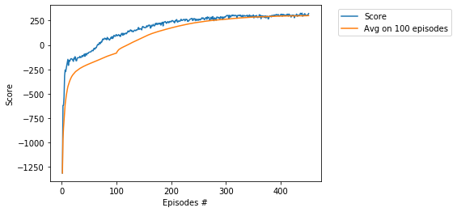

# Project - BipedalWalker with PPO, Vectorized Environment

### Requirement

* [python 3.7](https://www.python.org) 
* [pytorch 1.0.1](https://pytorch.org/)
* [gym 0.13.1](https://github.com/openai/gym)

### Environment

Just like the SAC env, This environment is simulated as list of 16 **gym** environments. They run in 16     
subprocesses adopted from [openai baseline](https://github.com/openai/baselines):

     num_processes=16
     envs = parallelEnv('BipedalWalker-v2', n=num_processes, seed=seed)       
     
### Hyperparameters

Agent uses the following hyperparameters:

_gamma=0.99_ # discount    
_epoch = 16_ # the parameter in the update
_mini_batch=16_ # self-explanatory
_lr = 0.001_ # learning rate    
_eps=0.2_ # the clipping parameter using for calculation of the _action loss_   

### Training the Agent

The agent completed training in **3 and a half hours**. Averaging a score of **300**. 

  
  
  

     
